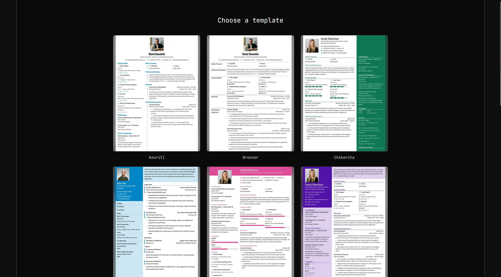

# WantAResume

Build a real, polished resume in your browser - no account, no backend, no data leaving your machine.

---

## The Idea

Most resume builders make you sign up, pick a template you can't really customize, and hope the PDF export doesn't quietly reflow your carefully-tuned layout. WantAResume skips all of that: pick a template, fill in a tabbed editor, and export a real PDF built from the same templates you're previewing - nothing rendered separately just for the download.

Everything lives entirely in your browser. Nothing is ever sent anywhere.

---

## What You Can Do

- **15 templates** to choose from on the homepage, each a faithful port of a real, proven resume layout
- **A tabbed editor** - Basics, Sections, Design - for everything from your contact info to page margins and accent colors
- **11 built-in section types** (Experience, Education, Skills, Projects, and more), each with drag-and-drop reordering
- **Custom sections** - add your own, name it whatever you like, and pick which of the built-in field layouts it should use
- **A live PDF preview**, generated from the exact same rendering engine as your final export
- **Full control over design** - colors, typography, page format, section columns, icon styling - no theme picker, just direct control
- **Works on mobile** - the whole editor, including drag-and-drop reordering, adapts down to a phone screen

---

## Your Data

Everything you enter - your resume content, template choice, and design settings - is saved automatically to your browser's local storage as you go. Close the tab, come back later, and it's all still there. There's no account to create and no server it's synced to; if you clear your browser's site data, it's gone, so export a PDF once you're happy with it.